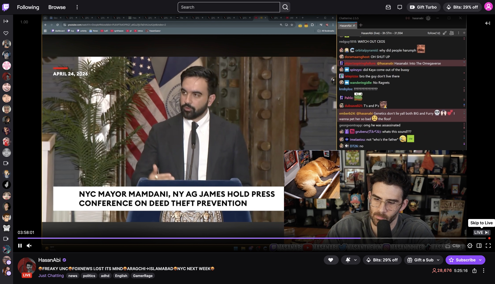
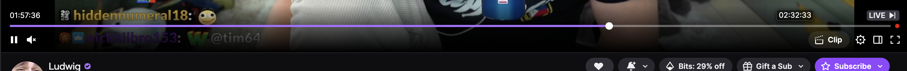

# Twitch Rewind

**Summary:**

A Manifest V3 Chrome extension that allows you to rewind any stream while watching live, irrespective of whether you've subbed or not

**Description:**

This extension tricks the twitch UI into believing that you are a twitch turbo user. You might see other changes on your UI due to this, apart from the rewind feature.

**Note** that this does not actually make you a turbo user.  You'll still see ads and you won't have a turbo batch in chat. Use an adblocker like https://github.com/pixeltris/twitchadsolutions to prevent any ads.

## How to Add

1. Clone this repo in your local system
2. Open Chrome and go to `chrome://extensions`.
3. Turn on **Developer mode** (top right).
4. Click **Load unpacked**.
5. Choose this repository’s root folder—the one that contains `manifest.json` (not a parent folder).

After code changes, click **Reload** on the extension card.

**Requirements:** Chrome **111+** (content scripts with `"world": "MAIN"` in the manifest).

### Screenshots

#### Full screen

---

#### Seekbar

---
